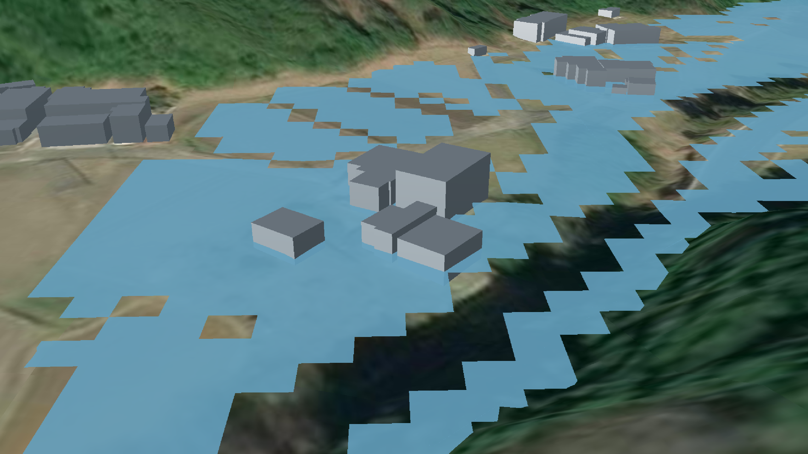

# 洪水浸水想定区域の時系列データ変換システム

 

## 1. 概要
本リポジトリでは、Project PLATEAUの令和6年度のユースケース開発業務の一部であるUC24-12「地区防災計画作成支援ツールの開発」について、その成果物である「洪水浸水想定区域の時系列データ変換システム」のソースコードを公開しています。

「洪水浸水想定区域の時系列データ変換システム」は、洪水浸水想定区域モデルを活用し、時系列で推移する浸水深を表現するデータへ変換するためのシステムです。

## 2. 「洪水浸水想定区域の時系列データ変換システム」について

「地区防災計画作成支援ツールの開発」では、[地区防災計画作成支援ツール](https://github.com/Project-PLATEAU/Disaster-Prevention-Planner)にて利用する洪水浸水想定区域モデルを時系列で推移する浸水深を表現するデータへ変換することを目的として本システムを開発しました。
なお、データ変換に使用する洪水浸水想定区域モデルは、国土交通省より公表されている[洪水浸水想定区域図作成マニュアル](https://www.mlit.go.jp/river/shishin_guideline/pdf/manual_kouzuishinsui_1710.pdf)に準拠したデータであることを想定しています。
本システムは、オープンソースソフトウェアとして開発されています。
本システムの詳細については[技術検証レポート](https://www.mlit.go.jp/plateau/file/libraries/doc/plateau_tech_doc_0107_ver01.pdf)を参照してください。

## 3. 利用手順
本システムの構築手順及び利用手順については[利用チュートリアル](https://project-plateau.github.io/Flood-Hazard-Map-Converter/)を参照してください。

## 4. システム概要
#### 【時系列データへの変換】
- CSV形式の洪水浸水想定区域モデルからCZML形式の時系列で推移する浸水深を表現するデータに変換されます。

## 5. 利用技術

| 種別              | 名称   | バージョン | 内容 |
| ----------------- | --------|-------------|-----------------------------|
| プログラミング言語       | [python](https://www.python.org/) | 3.12.4 | オープンソースのプログラミング言語 |
| ライブラリ      | [pandas](https://pandas.pydata.org/) | 2.2.2 | データ解析や操作を容易にするためのデータ構造とツールを提供するライブラリ |
|       | [geopandas](https://geopandas.org/en/stable/) | 1.0.1 | 空間データの処理や解析を容易にするためのライブラリ |
|       | [shapely](https://shapely.readthedocs.io/en/2.0.4/manual.html) | 2.0.5 | 点やポリゴンなどの幾何オブジェクトを操作するライブラリ |

## 6. 動作環境
| 項目               | 最小動作環境                                                                                                                                                                                                                                                                                                                                    | 推奨動作環境                   | 
| ------------------ | ------------------------------------------------------------------------------------------------------------ | ------------------------------ | 
| OS                 | Microsoft Windows または Linux または　Mac                                                                        |  同左 | 
| CPU                | Intel Core i3以上                                                                                                                                | Intel Core i5以上              | 
| メモリ             | 4GB以上                                                                                                                                         | 8GB以上                        | 
| ディスプレイ解像度 | 不問                                                                                                                                         |  同左                   | 
| ネットワーク       | 不要 |  同左                            | 

## 7. 本リポジトリのフォルダ構成
| フォルダ名 |　詳細 |
|-|-|
| Converter | 変換ツール |

## 8. ライセンス

- ソースコード及び関連ドキュメントの著作権は国土交通省に帰属します。
- 本ドキュメントは[Project PLATEAUのサイトポリシー](https://www.mlit.go.jp/plateau/site-policy/)（CCBY4.0及び公共データ利用規約1.0）に従い提供されています。

## 9. 注意事項

- 本リポジトリは参考資料として提供しているものです。動作保証は行っていません。
- 本リポジトリについては予告なく変更又は削除をする可能性があります。
- 本リポジトリの利用により生じた損失及び損害等について、国土交通省はいかなる責任も負わないものとします。

## 10. 参考資料
- 技術検証レポート: https://www.mlit.go.jp/plateau/file/libraries/doc/plateau_tech_doc_0107_ver01.pdf
- PLATEAU WebサイトのUse caseページ「地区防災計画作成支援ツールの開発」: https://www.mlit.go.jp/plateau/use-case/uc24-12/
- 洪水浸水想定区域図作成マニュアル：https://www.mlit.go.jp/river/shishin_guideline/pdf/manual_kouzuishinsui_1710.pdf
